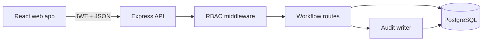

# CareFlow — Clinical Workflow Platform

CareFlow is a production-shaped full-stack portfolio project for coordinating clinical operations. It demonstrates secure authentication, role-based authorization, relational data modelling, appointment scheduling, case workflows, audit trails, optimistic concurrency, tests, and a responsive React interface.

> **Portfolio demonstration only.** All included people and records are fictional. CareFlow is not certified for medical use and should not store real patient data.

## Highlights

- Secure JWT sign-in with `ADMIN`, `CLINICIAN`, and `RECEPTIONIST` roles
- Searchable patient directory with unique medical record numbers
- Appointment scheduling and live visit-status updates
- Kanban-style clinical case workflow
- Optimistic concurrency to prevent silent overwrites
- Immutable activity audit trail for sensitive actions
- PostgreSQL schema with indexes and foreign keys
- Zero-configuration embedded PostgreSQL-compatible demo database
- Responsive, accessible React dashboard
- API and UI tests, strict TypeScript, and GitHub Actions CI
- Docker Compose setup for a real PostgreSQL instance

## Product tour

| Area | Capabilities |
|---|---|
| Dashboard | Operational metrics, upcoming visits, priority cases |
| Patients | Search, registration, risk classification, record numbers |
| Appointments | Booking, clinician assignment, visit lifecycle |
| Cases | Intake-to-closure workflow with priority and ownership |
| Audit | Actor, action, entity, and timestamp history |

## Technology

**Frontend:** React 19, TypeScript, Vite, Lucide icons, responsive CSS  
**Backend:** Node.js, Express 5, TypeScript, Zod, JWT, bcrypt, Helmet, Pino  
**Data:** PostgreSQL / pg-mem, SQL migrations, foreign keys, indexes  
**Quality:** Vitest, Testing Library, Supertest, GitHub Actions, Docker Compose

## Quick start

Requirements: Node.js 20+ and npm 10+.

```bash
npm install
npm run dev
```

Open [http://localhost:5173](http://localhost:5173). The API runs at `http://localhost:4000`.

### Demo accounts

Every account uses the password `demo1234`.

| Role | Email | Permissions |
|---|---|---|
| Administrator | `admin@careflow.demo` | Full access, including audit history |
| Clinician | `sofia@careflow.demo` | Patients, appointments, cases, audit |
| Receptionist | `alex@careflow.demo` | Patient registration and scheduling |

The default setup uses an in-process PostgreSQL-compatible database and resets when the API restarts. This makes the project immediately runnable without Docker.

## Real PostgreSQL

Start PostgreSQL:

```bash
docker compose up -d postgres
cp .env.example .env
```

Uncomment `DATABASE_URL` inside `.env`, then restart `npm run dev`. For a real deployment, replace the demo schema bootstrap with versioned migrations and use a secret manager for `JWT_SECRET`.

## Commands

```bash
npm run dev        # API and web development servers
npm run build      # Production builds for both workspaces
npm run test       # API integration and UI component tests
npm run typecheck  # Strict TypeScript validation
npm start          # Start the compiled API
```

## API overview

All routes except login and health require `Authorization: Bearer <token>`.

| Method | Endpoint | Purpose |
|---|---|---|
| POST | `/api/auth/login` | Authenticate and issue an 8-hour token |
| GET | `/api/dashboard` | Operational totals |
| GET / POST | `/api/patients` | Search or register patients |
| PATCH | `/api/patients/:id` | Update risk with version checking |
| GET / POST | `/api/appointments` | List or schedule appointments |
| PATCH | `/api/appointments/:id/status` | Change visit status |
| GET / POST | `/api/cases` | List or create clinical cases |
| PATCH | `/api/cases/:id/stage` | Move a case with version checking |
| GET | `/api/audit` | Read the latest audit events |

## Architecture



The application is a monorepo with two independently buildable workspaces:

```text
apps/
├── api/    Express API, database bootstrap, authorization, tests
└── web/    React UI, workflow screens, components, tests
```

### Engineering decisions

1. **Optimistic concurrency:** patients and cases include a version number. Stale writes return `409 Conflict`, preventing hidden data loss during simultaneous edits.
2. **Audit at the command boundary:** every security-sensitive mutation writes an event with actor, entity and metadata.
3. **Provider-neutral SQL:** application queries work against embedded pg-mem and a real PostgreSQL server.
4. **Role enforcement in the API:** the frontend improves usability, but authorization never depends on hidden buttons.
5. **Fictional seed data:** reviewers can explore the application immediately without accessing sensitive information.

## Security model

- Passwords are hashed with bcrypt.
- JWTs expire after eight hours.
- Helmet adds defensive HTTP headers.
- Request bodies are size-limited and validated with Zod.
- Role authorization is applied per route.
- Database operations use parameterized queries.
- Audit events record authentication and data mutations.

For production, add refresh-token rotation, rate limiting, MFA, encryption-key management, backups, monitoring, vulnerability scanning, retention policies, and a formal compliance review.

## Roadmap

- OpenAPI documentation and generated API client
- Versioned PostgreSQL migrations
- Pagination and saved filters
- Notifications and background workers
- File attachments with malware scanning
- End-to-end browser tests
- OpenTelemetry traces and metrics

## License

MIT. See [LICENSE](LICENSE).
